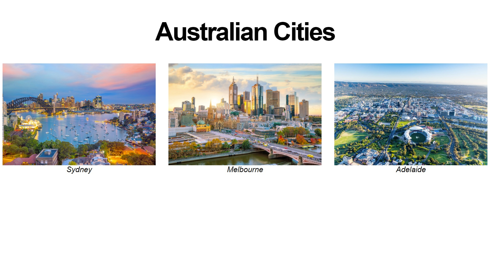

# Exercise 1 - CSS & HTML

Build a page that looks identical to `exercise1/page.jpg`. The window width you can work with is up to you. We'll be flexible marking this. You are only allowed to use HTML and CSS for this task. No external libraries are permitted.

Please build your page in `exercise1/index.html`. You are welcome to create as many CSS files that you need in the `exercise1` folder for `index.html` to import. When being marked, your tutor will start with `index.html`.

### Assets

* Please use the following images:
    * Sydney: https://www.telegraph.co.uk/content/dam/Travel/Destinations/Oceania/Australia/Sydney/sydney-guide-lead-sunset.jpg
    * Melboune: https://www.rmit.edu.au/content/dam/rmit/au/en/news/news_Melbourne_AdobeStock.jpg
    * Adelaide: https://d31atr86jnqrq2.cloudfront.net/images/aerial-city-adelaide.jpg
* Your font doesn't have to match exactly. You may use font-family `Arial` or `sans-serif` for the page.
