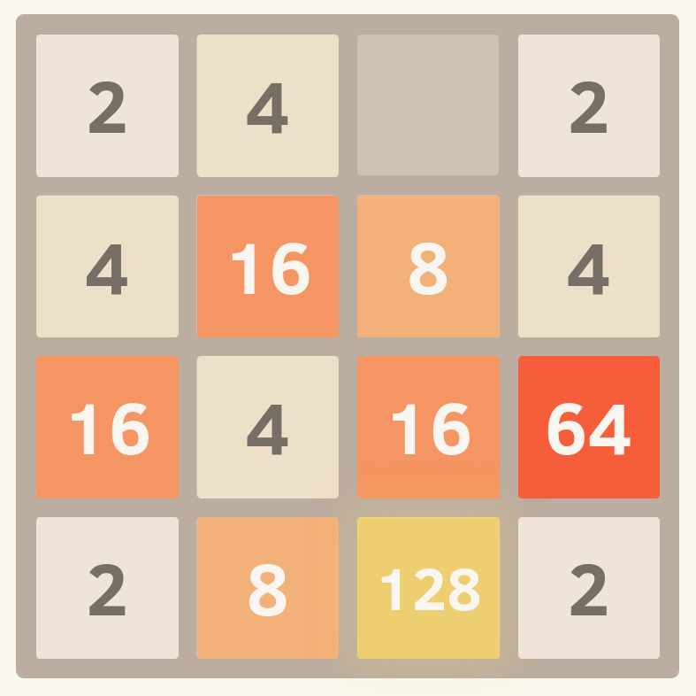

## Exercise 14 - Static, fixed size page

Build a page that looks identical to `page.png`. The window width you should work with is 787 x 786 pixels. You are only allowed to use HTML and CSS for this task. No external libraries are permitted.

Please build your page in `index.html`. You are welcome to create as many CSS files that you need in the `Exercise14` folder for `index.html` to import. When being marked, your tutor will start with `index.html`.

#### Assets
* Your font doesn't have to match exactly. Please use font-family `Arial` for the page.
