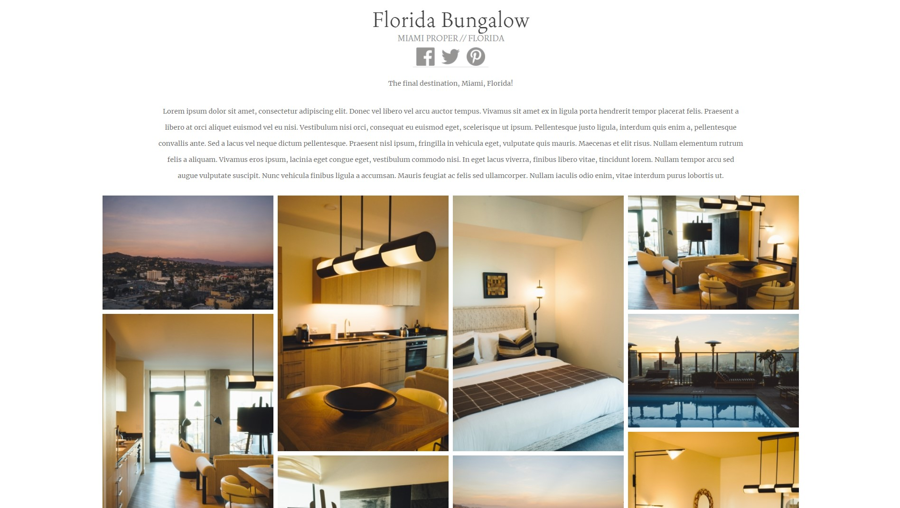

# Exercise 3 - CSS & HTML

Build a page that looks identical to `exercise3/page.jpg`. The window width you should work with is 1896 x 1073 pixels. You are only allowed to use HTML and CSS for this task. No external libraries are permitted.

Please build your page in `exercise3/index.html`. You are welcome to create as many CSS files that you need in the `exercise3` folder for `index.html` to import. When being marked, your tutor will start with `index.html`.

### Assets

* Assets can be found in `exercise3/assets` which you can use for your solution.
* Your font doesn't have to match exactly. You may use font-family `Georgia` or `serif` for the page.
* You may use a Lorem Ipsum generator such as [this](https://www.lipsum.com/) to generate the text.
