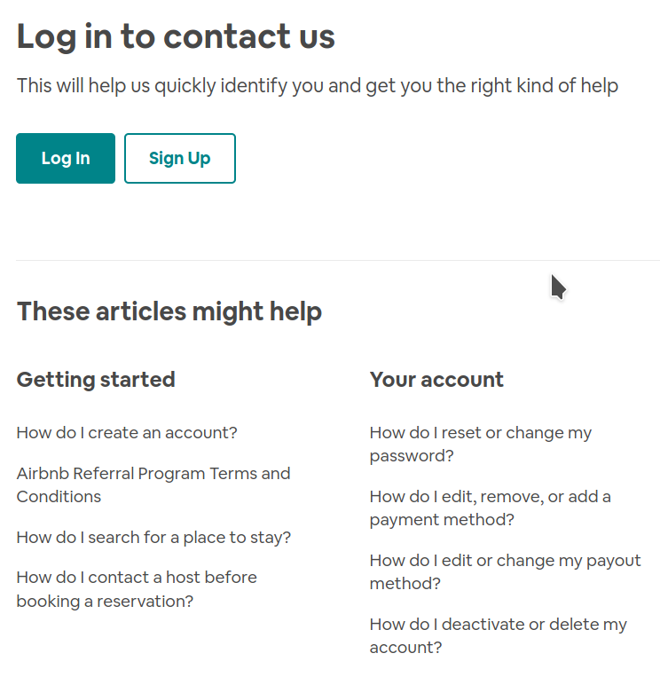

# Exercise4 - Airbnb Contact Page

`airbnb.png` is a "Contact Us" page taken from the airbnb website.

Create a page in `airbnb.html` that uses HTML and CSS to produce a page that looks as close to the png as possible.

Hint: The font-family is `Circular`, which you don't have to replicate. Focus on structure, spacing, and font-sizes.
