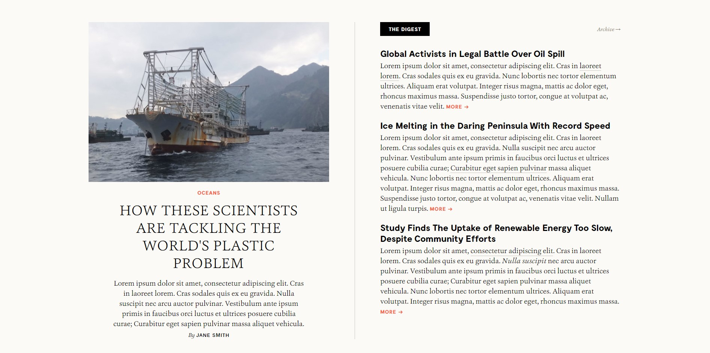

## Exercise 5 - HTML & CSS

Build a page that looks identical to `Exercise5/page.jpg`. The window width you should work with is 1892 x 943 pixels. You are only allowed to use HTML and CSS for this task. No external libraries are permitted.

Please build your page in `Exercise5/index.html`. You are welcome to create as many CSS files that you need in the `Exercise1` folder for `index.html` to import. When being marked, your tutor will start with `index.html`.
