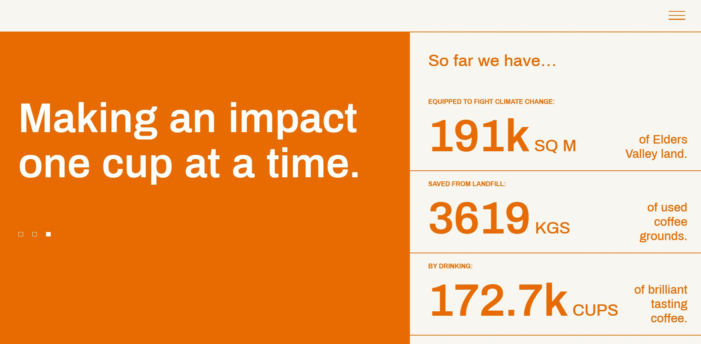

## Exercise 3 - HTML & CSS

Build a page that looks identical to `Exercise8/page.jpg`. The window width you should work with is 1907 x 937 pixels. You are only allowed to use HTML and CSS for this task. No external libraries are permitted.

Please build your page in `Exercise8/index.html`. You are welcome to create as many CSS files that you need in the `Exercise8` folder for `index.html` to import. When being marked, your tutor will start with `index.html`.

### Assets

* Your fonts do not need to match exactly. You may use font-family `sans-serif` for the page.

### Solution

This solution is given by UNSW CSE.
